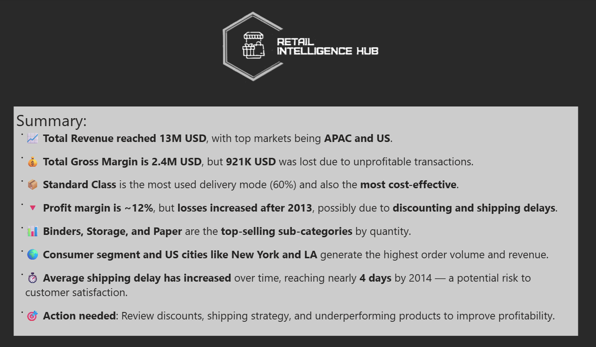

# Retail Intelligence Hub  

📊 **Retail Intelligence Hub** is a data-driven dashboard project designed to analyze global retail performance, customer segmentation, shipping delays, and profitability trends. It provides actionable insights to improve revenue, margins, and customer satisfaction.  

---

## 🚀 Features  
- **Global Coverage**: Data across **139 countries** and **2,397 cities**.  
- **Revenue Insights**:  
  - Total Revenue: **$13M USD**  
  - Gross Margin: **$2.4M USD**  
  - Losses: **$921K USD** due to unprofitable transactions  
- **Delivery Performance**:  
  - Standard Class is the most used (60%) and most cost-effective.  
  - Average shipping delay reached **4 days by 2014** (risk to satisfaction).  
- **Customer Segmentation**: Consumer, Corporate, and Home Office analyzed.  
- **Top Markets**: **APAC and US** lead in order volume and revenue.  
- **Profitability Challenges**: Losses increased after 2013 due to **discounting and shipping inefficiencies**.  

---

## 📌 Key Insights  
- 📈 **Total Revenue**: $13M with APAC and US as top markets.  
- 💰 **Profit Margin**: ~12% (but declining post-2013).  
- 📦 **Shipping**: Standard Class dominates, but delays are growing.  
- 🗂️ **Top Products**: Binders, Storage, Paper, Phones, and Accessories.  
- 🌍 **Cities Driving Sales**: New York, Los Angeles, San Francisco, Seattle.  
- ⚠️ **Action Needed**: Review discount strategy, optimize logistics, and address underperforming products.  

---

## 📊 Dashboards  

### 1. **Summary Insights**  
  

### 2. **Revenue & Market Performance**  
  

### 3. **Profitability & Shipping Delays**  
  

### 4. **Retail Intelligence Branding**  
  

---

## 🛠️ Tech Stack  
- **Data Visualization**: Power BI  
- **Data Source**: Retail transaction dataset (multi-year, global coverage)  
- **KPIs Tracked**: Revenue, Profit, Margin, Shipping Delays, Discounts, Customer Segments  
